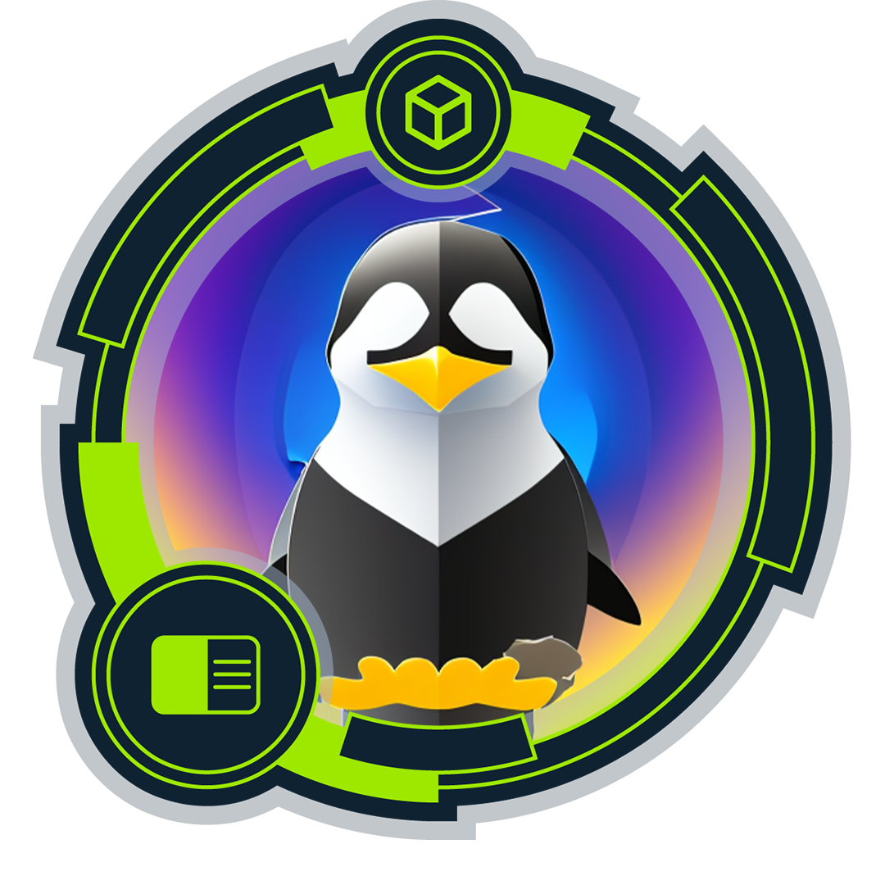
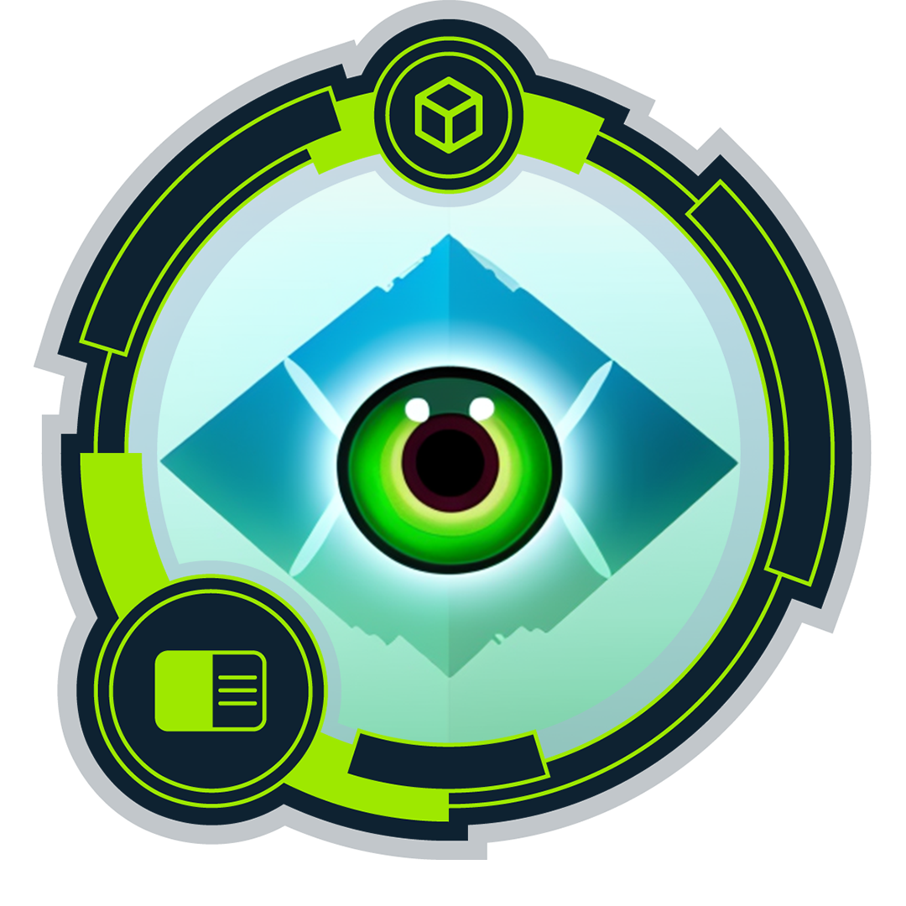

<link href="https://cdn.jsdelivr.net/npm/bootstrap@5.0.2/dist/css/bootstrap.min.css" rel="stylesheet"
    integrity="sha384-EVSTQN3/azprG1Anm3QDgpJLIm9Nao0Yz1ztcQTwFspd3yD65VohhpuuCOmLASjC" crossorigin="anonymous">
<h1 align="center">Hi, I'm Tasdid Hasnain 👋🏾 🙂</h1>
<h5 align="center">I'm a Full Stack Web Developer & Cybersecurity Analytics.</h5>
  

    

 

  

    

<h2 align="center">🏴 Hack The Box Achievements</h2>

    
    
    

<h5 align="center">I work with perfection and find a simple solution to every difficult task.  
I always avoid complexity. I love to do everything simply and smartly.</h5>
 
<h2 align="center">Languages and frameworks that I work with:</h2>
 

<b>Front-End</b>

 

 
    
    
    
    
    
    
    
    
    
    
    
    
    
    
    
    

 

<b>Back-End & Database</b>

 

 
    
    
    
    
    
    
    
    
    
    
    
    

 

<b>Other</b>
 

 
    
    
    
    
    
    
    
    
    
    
    
    

 

<h5>
    
- 🔭 I’m currently working on **full stack Web & cybersecurity analytics.**

- 🌱 I’m interested to develop a **web application for you.**

- 👯 I’m looking to collaborate on **GitHub**

- 👨‍💻 All of my projects are available at [https://github.com/Tasdid000](https://github.com/Tasdid000)

- 💬 Ask me about **full-stack development and cybersecurity**

- 📫 How to reach me **Follow my contact information given below...**

- 📄 Know about my experiences [here](https://www.canva.com/design/DAGJrmKNFtQ/1kPRc78S-qLlF7dLVThkhg/edit?utm_content=DAGJrmKNFtQ&utm_campaign=designshare&utm_medium=link2&utm_source=sharebutton)
</h5>

<h3 align="left">Connect with me:</h3>

    

   

     

&nbsp;

  
<h3 align="left">🔥 My Stats :</h3>
  

